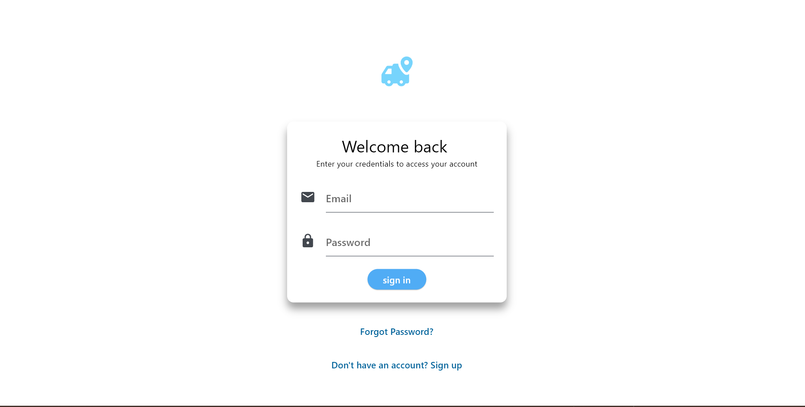

# practiceapplication

I used this application as a practice example to create a login page.
If you find it useful, you can get it and use the logging template, which was the main focus for me.
The application does not contain backend code; it is just the UI for Login.

